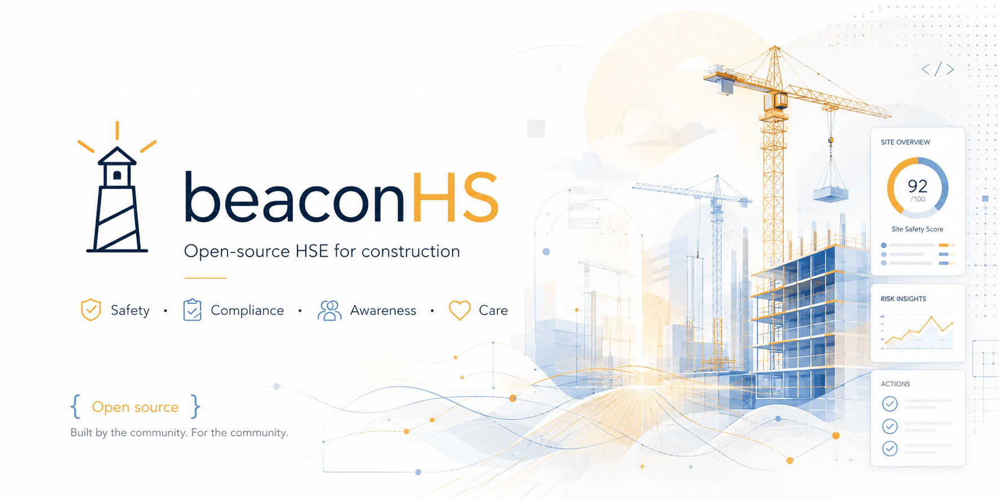

<p align="center">
  
</p>

<p align="center">
  <strong>Open-source Health, Safety &amp; Environment platform for industrial construction.</strong><br />
  Incidents, inspections, training, equipment, permits, and a form engine powerful enough to model your whole safety program.
</p>

<p align="center">
  
  
  
  
  
  
</p>

---

## What is BeaconHS?

BeaconHS is a multi-tenant HSE platform built for the realities of industrial
construction — crews on multiple sites, equipment that moves, certs that
expire, permits that have to be signed before anyone enters a space, and an
auditor who will eventually ask for the paper trail.

It started as a ground-up rewrite of a long-running production safety system
and is now open source: **built by the community, for the community.** Self-host
it, extend it, or run it as the backbone of your safety program.

> [!NOTE]
> BeaconHS is under active development ahead of its first tagged release. The
> module surface below is built and running; APIs and schema may still shift
> before `v1.0`.

## Why it's different

- **A form engine that replaces modules.** Most safety apps bolt a rigid form
  tool onto hard-coded screens. BeaconHS inverts that — a single, serious form
  engine (conditional logic, formulas, repeating sections, entity lookups,
  scoring, drawn signatures, multi-step workflows) is powerful enough that
  job-specific paperwork like lift plans are *just templates*, seeded per tenant
  and fully editable. Native modules are reserved for things every HSE program
  needs.
- **Multi-tenant from the first line.** Postgres row-level security on every
  tenant-scoped table — isolation is enforced at the database, not just the
  app.
- **Real construction workflows.** Confined-space permits with atmospheric
  readings, lone-worker check-in/escalation, equipment QR + location history,
  training matrices and competency authorities, JSHA/HazID risk assessments
  with pre/post-control ratings.
- **An audit trail by default.** Every mutation writes a before/after diff.

## Features

### Frontline
- **Forms** — world-class designer + filler: conditional `show-when` logic,
  calculated/formula fields, per-field validation, default values, repeating
  sections, multi-step workflows with progress, drawn-signature canvas,
  photo/file/video uploads, entity-attribute lookups (pick an equipment item →
  pull its live status), compliance scoring with auto-flagging, **spawn a
  corrective action or incident straight from a non-compliant response**, and
  save-and-resume drafts that survive a dropped connection.
- **Inspections** — reusable criteria banks, inspection types, per-criterion
  severity / non-compliance reason / action-taken / corrected-date, customer
  signature, and assignment compliance roll-ups.
- **JSHA / HazID** — task → hazard → control risk assessments with pre- and
  post-control likelihood × severity ratings, PPE requirements, signatures by
  role, confined-space and arc-flash sections, and one-click *copy assessment*.
- **Toolbox talks** — attendee sign-on with signatures, photos, assignment
  cadence, and per-person attendance transcripts.
- **Incidents** — full taxonomy plus a real investigation workflow (event
  timeline, contributing factors, 5-whys root cause, preventative steps),
  lost-time tracking, TRIR / DART / OSHA-300A reporting.
- **Corrective Actions (CAPA)** — standalone or linked to any source, verification
  step before close, aging reports, photo evidence, bulk reassignment.

### Programs
- **Training** — courses, scheduled classes with a calendar view, certificates
  (PDF + QR-verifiable), skills & certifying authorities, a person × course
  compliance matrix, transcripts, and course file attachments.
- **Documents** — versioned library with rich-text **or** uploaded PDF/DOCX
  sources, acknowledgment tracking, periodic reviews, document books, and a
  reference library.
- **Confined Space** — permit lifecycle, atmospheric readings with out-of-spec
  alarms, and calibrated sensor tracking.
- **Lone Worker** — timed check-in sessions with escalation.

### Assets & people
- **Equipment** — asset registry, QR labels (single + bulk), check-in/out,
  location history, work orders, expenses & rates, truck logs, fleet summary
  and ROI reports, and report-missing/found.
- **PPE** — issue / return / inspect lifecycle, per-type criteria, annual
  third-party recertification, expiry & due reports.
- **People & org** — divisions, groups, job titles with task-acknowledgment
  matrices, an org chart, CSV bulk import, personal file uploads, and user
  signatures.

### Insight & platform
- **Role-aware dashboards** — a drag-resize widget grid with per-role defaults
  (super-admin / tenant-admin / safety-manager / foreman / worker) that each
  user can customize from a widget palette.
- **Reports** — built-in report library + a custom report builder + scheduled
  email delivery.
- **Compliance** — cross-module roll-ups by entity, person, and site.
- **Notifications** — in-app inbox, email, and Web Push with per-category /
  per-channel preferences.
- **Plugin framework & public REST API** — first-party plugins (sync in/out,
  UI panels, custom field types) and per-tenant API keys.

## Tech stack

| Layer | Choice |
|---|---|
| Framework | Next.js 16 (App Router, Turbopack) + React 19 |
| Language | TypeScript 5 |
| Database | PostgreSQL with row-level security |
| ORM | Drizzle |
| Auth | Better-Auth (email/password + magic link) |
| Styling | Tailwind CSS + a shared component library |
| Jobs | BullMQ on Redis |
| Storage | S3-compatible (MinIO in dev, Cloudflare R2 in prod) |
| PDF | Puppeteer render pipeline |
| Monorepo | Turborepo + pnpm workspaces |

## Quick start

You'll need **Node 20+**, **pnpm**, and **Docker**.

```bash
# 1. Install dependencies
corepack enable
pnpm install

# 2. Bring up local infra (Postgres, Redis, MinIO, Mailpit)
docker compose up -d

# 3. Configure env (defaults target the docker-compose services)
cp .env.example .env

# 4. Set up the database (schema + RLS policies + seed data)
pnpm db:generate
pnpm db:migrate
pnpm db:seed

# 5. Run the app
pnpm dev
```

Then open:

| Service | URL |
|---|---|
| App | http://localhost:3000 |
| Mailpit (catches outbound email) | http://localhost:8025 |
| MinIO console | http://localhost:9001 |

Sign in as the seeded super-admin `admin@beaconhs.local` via the **Magic link**
tab — the link arrives in Mailpit.

Full details, ports, and gotchas: **[`docs/QUICKSTART.md`](docs/QUICKSTART.md)**.

## Project structure

```
apps/
  web/        Next.js app — UI, server actions, API routes
  worker/     BullMQ worker — PDFs, email, notifications, scheduled jobs
packages/
  db/         Drizzle schema, migrations, RLS policy installer, seeds
  forms-core/ Form schema, validators, logic + formula evaluators
  forms-pdf/  Server-side form/report/certificate PDF rendering
  ui/         Shared React component library
  auth/       Better-Auth configuration
  tenant/     Tenant context + RLS helpers
  events/     Module event bus → notifications
  jobs/       Queue definitions
  emails/     Transactional email templates
  storage/    S3/R2 client + presigned uploads
  plugin-sdk/ Plugin interface contracts
```

## Roadmap

BeaconHS is built; the focus now is hardening, depth, and migration tooling.
The full phased plan and architectural decisions live in
**[`docs/IMPLEMENTATION_PLAN.md`](docs/IMPLEMENTATION_PLAN.md)**.

## Contributing

Contributions are welcome — issues, discussions, and PRs all help.

1. Fork the repo and create a feature branch.
2. `pnpm install` and follow the Quick start.
3. Keep changes type-safe (`pnpm typecheck`) and migrations idempotent.
4. Open a PR describing the change and the workflow it improves.

If you run an HSE program and something here doesn't match how your crews
actually work, that feedback is gold — open an issue.

## License

BeaconHS is free and open source. _A `LICENSE` file will accompany the first
public release_ — if you're adopting it before then, open an issue to confirm
terms.

---

<p align="center">
  <em>Built by the community. For the community.</em>
</p>
