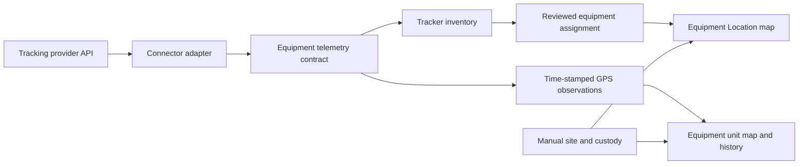

# Equipment location integrations

BeaconHS keeps equipment GPS tracking separate from the equipment register and
manual custody. Fleet Complete / Powerfleet Unity is the first adapter for this
shared location system. The equipment screens, stored observations, tracker
assignments, permissions, and health indicators are provider-neutral.

## Delivery plan

1. Inspect the subscribed fleet and verify its API against real responses.
2. Add a supplemental telemetry contract to the existing integrations system.
3. Persist tracker inventory and time-stamped observations with tenant isolation.
4. Let administrators review tracker-to-equipment assignments.
5. Add **Location** after **Maintenance**, with a map, reporting health, search,
   filters, and paginated details. Show the linked tracker on equipment unit pages.
6. Validate the full CI gates and repeated database migrations.
7. Deploy the validated application, pull the live inventory through its worker,
   link verified equipment, and enable updates every five minutes.
8. Confirm a scheduled pull and inspect the live map and unit pages.

## Data flow

Connectors use the existing encrypted connection settings, execution ledger,
worker queue, and cadence scanner. GPS does not create equipment items, claim
canonical import ownership, change odometers, rename equipment, or record a
custody transfer.

The same connection cannot run concurrently. Inventory persistence and assignment
changes share a connection lock. Inventory identities are unique within their
connection, and an equipment item has at most one linked tracker. Composite
foreign keys and row-level security protect tenant boundaries.

Observations retain their original time and the equipment assignment effective
when that observation was imported. Readings from before a binding stay
unassigned. Moving a tracker never rewrites its earlier equipment history. A late
reading from before the current binding also stays unassigned. The integration
history screen remains available to review those source readings.

## Fleet Complete / Unity adapter

The adapter authenticates with an integration account at
`https://api.fleetcomplete.com`, selects its configured fleet user ID, and reads
inventory and GPS snapshots through GraphQL. It does not depend on a browser
session or a copied dashboard token.

Connection settings include an explicit coordinate unit, initial history window,
and stale-position threshold. TELUS responses inspected for this rollout use
decimal degrees, despite the public GPS type describing arc minutes. Coordinates
are never guessed from their magnitude.

The initial history window is bounded to 24 hours. Subsequent pulls overlap the
cursor by ten minutes and deduplicate observations by tracker and observation
time. Tokens refresh during long pulls; transient API failures retry with bounded
backoff. Authentication errors, malformed inventories, conflicting observations,
and truncated history produce an actual failed run. They do not advance the
history cursor or erase existing inventory.

Deleting a connection releases its current equipment links while preserving
source history. Pausing its schedule leaves last-known positions visible with a
paused health state.

## What the map means

- **Reporting** requires a recent valid GPS fix and a healthy, enabled integration.
- **GPS observed** is the provider observation time, not the time BeaconHS fetched it.
- Stale or invalid readings remain identifiable. Refreshing the integration does
  not make an old GPS fix appear current.
- Equipment without a position remains in the searchable details list.
- Map markers group equipment at the same coordinates so overlapping units remain
  selectable. The map reflects the current page and filters.
- The unit page shows the last-known position and the current page of its assigned
  GPS history. Earlier unassigned source history is available under Integrations.
- OpenStreetMap provides the basemap. If tiles cannot load, equipment coordinates,
  observation times, and details remain available.

Equipment visibility follows the existing equipment permissions and scope.
Integration configuration and tracker assignment require
`admin.integrations.manage`. Assignment changes are audited. GPS observations do
not overwrite manually recorded site or holder information.

## Rollout and verification

Keep the connection schedule disabled until the deployed worker can successfully
pull the source. Review exact unique equipment tag or VIN matches before linking;
leave ambiguous identities unassigned for the owner to resolve. Enable the
five-minute cadence after the initial successful pull and assignment review.
Confirm both a repeated manual run and an independently scheduled successful run.

Required local gates are `pnpm format:check`, `pnpm typecheck`, `pnpm lint`,
`pnpm test`, `pnpm deadcode:check`, and `pnpm build`. CI enables the real PostgreSQL
telemetry test with `BEACON_TELEMETRY_DB_TEST=1`; that test refuses non-local database
hosts. It exercises tenant isolation, binding constraints, monotonic latest fixes,
history deduplication, preview behavior, and transaction rollback. The production
migration path is applied twice in CI to verify idempotence.

The first subscribed fleet contains 57 trackers. The pre-deployment review found
53 unique matches against BeaconHS equipment. Four source identities need physical
equipment confirmation: `PWR6`, `016080004862979`, `000042132001`, and
`015910002261884`. These counts describe the reviewed inventory and may change as
the provider fleet changes.

The in-app equipment and integrations articles explain the operational flows.
The equipment Location walkthrough covers the map, equipment details, and manual
custody distinction.
